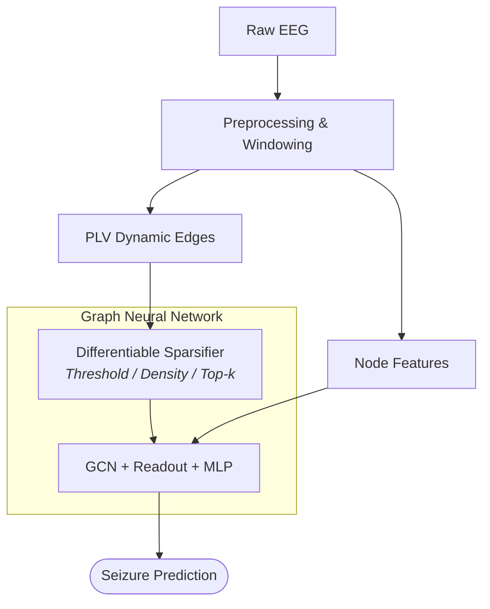

# eeg-brain-graph-sparsification
*Automatic, differentiable brain graph sparsification for EEG seizure detection*

[](https://www.python.org/downloads/release/python-3120/)
[](https://pytorch.org/)
[](https://pyg.org/)
[](LICENSE)


## 📌 About The Project

Graph Neural Networks (GNNs) applied to functional brain connectivity graphs have demonstrated strong potential for automated epileptic seizure detection. However, raw connectivity graphs (e.g., Phase Locking Value — PLV) are typically fully connected and noisy. Standard graph construction relies on static, manually tuned thresholding heuristics or costly hyperparameter sweeps, which can be sensitive to the choice of dataset.

This repository proposes and implements **learnable, differentiable graph sparsification layers**, operating at the edge-weight level, trained end-to-end via gradient descent alongside a GCN-based classifier:
- **Threshold Sparsifier**: Learns an adaptive global cutoff $\tau \in [0, 1]$.
- **Density Sparsifier**: Learns a target graph density $\hat{r}$ via differentiable quantile interpolation.
- **Top-$k$ Sparsifier**: Learns local connectivity bounds per node ($\theta_v$) or globally ($\theta$), retaining the the k strongest connections for each EEG channel.
- **Differentiable Operators**: Supports hard thresholding via **ReLU** ($\max(0, e_{ij} - \tau)$) and soft gating via **Sigmoid** ($e_{ij} \cdot \sigma(\alpha(e_{ij} - \tau))$), where $e_{ij}$ are the edges weights.

Evaluated on the **CHB-MIT Scalp EEG database** using **Group 5-Fold Cross-Validation** (strictly subject-independent splits) and optimized with **Focal Loss** to handle severe class imbalance.


## ⚙️ Pipeline Overview



## 🚀 Getting Started

### 1. Install Dependencies
First you need to clone this repository and install required dependencies
*Recommended environment: Python 3.12+ with CUDA acceleration.*

```bash
python -m venv .venv
source .venv/bin/activate

pip install -r requirements.txt
```

### 2. Data Setup

Download the **CHB-MIT Scalp EEG Database** from [PhysioNet](https://physionet.org/content/chbmit/1.0.0/) and extract it into `data/chb-mit/`:

```text
eeg-brain-graph-sparsification/
└── data/
    └── chb-mit/
        ├── chb01/
        ├── chb02/
        ├── chb03/
        └── ...
```

### 3. Run Experiments

Run the complete pipeline (preprocessing, feature extraction, baseline evaluation, and learnable sparsifier training):

```bash
bash run_experiments.sh
```

All trained checkpoints and metrics will be saved in `models/` and `results/` respectively.


## 📊 Experimental Results

All models were evaluated under **Patient-level Group 5-Fold Cross-Validation** (strict subject-independent splits) using PR-AUC, Balanced Accuracy, and $F_1$-score to account for high class imbalance. The most important results are presented below:

### 1. Threshold Sparsifier Analysis

The Threshold Sparsifier learns a single, shared scalar cutoff $\tau \in [0, 1]$ optimized end-to-end to remove spurious functional edges across dynamic PLV graphs.

#### Performance vs. Fixed Threshold Values

Comparing static cutoff values $\tau \in [0.0, 0.1, ..., 0.9]$ against learnable models:

<p align="center">
  
</p>

- **Peak Performance & Convergence**: The learnable ReLU variant achieved the highest PR-AUC across all evaluated configurations (0.7438 ± 0.1348) while ranking near the top in Balanced Accuracy and $F_1$-score.
- **Automated Parameter Convergence**: Additonally calculated, for ReLU variant, the learned threshold converged to $\tau^* = 0.1450 \pm 0.0461$ across folds, perfectly capturing the empirical optimum ($0.1 \le \tau \le 0.2$) observed during brute-force grid searches.
- **Edge Dropout Sensitivity**: Static thresholds above $\tau \ge 0.4$ caused severe performance degradation across all metrics due to excessive network fragmentation and loss of essential functional paths.
- **ReLU vs. Sigmoid**: ReLU achieved better results potentially by strictly zeroing out noisy low-synchrony connections, whereas Sigmoid retains small attenuated residuals below the threshold.


### 2. Top-$k$ Per-Node Sparsification & Biological Interpretability

The Top-$k$ Per-Node strategy allows each EEG electrode to adaptively learn its own neighborhood size ($k_v \in [1, 21]$, since there are 22 channels in total), providing localized edge filtering.

#### Performance vs. Fixed Neighborhood Baselines
Comparing static neighbor sweeps ($k \in \{1, \dots, 21\}$) against learnable Per-Node models (ReLU vs. Sigmoid gating):

<p align="center">
  
</p>

- The learnable Sigmoid variant matches the top manually tuned static baselines ($k = 13$ and $k = 16$), this time outperforming the harder ReLU gating.
- Eliminates the need to test 21 discrete neighbor sizes per task.

#### Learned Spatial Neighborhood Topology ($k_v$ distribution)
Averaged across all 5 test folds, the learned degree distribution per bipolar channel was mapped onto scalp geometry:

<p align="center">
  
</p>

- **Inter-hemispheric Asymmetry**: Electrodes over the left hemisphere (odd-numbered designations, e.g., `T7-FT9`, `T7-P7`, `F3-C3`, `P7-T7`) consistently learned larger receptive neighborhoods ($k \approx 11 - 12$ neighbors) compared to channels in the right hemisphere ($k \approx 7 - 9$).
- **Interpretability**: One possible explanation is the prevalence of left-lateralized seizure onsets in the CHB-MIT cohort, however, this hypothesis requires further clinical validation. Regardless, this asymmetry highlights the adaptability of learnable sparsifiers, enabling GNNs to tailor receptive fields directly to functional patterns in the data without manual tuning.


---

### 3. Overall Performance Comparison

Comparison of the best static configurations against their learnable counterparts across all investigated sparsification paradigms :

| Sparsification Strategy | Configuration / Variant | PR-AUC | Balanced Accuracy | $F_1$ Score |
| :--- | :--- | :---: | :---: | :---: |
| **Threshold** | Learnable (ReLU) | 0.7438 ± 0.1348 | 0.7950 ± 0.0617 | 0.6684 ± 0.1065 |
| | Fixed Cutoff ($\tau = 0.1$) | 0.7273 ± 0.1257 | <u>0.8034 ± 0.0487</u> | **0.6779 ± 0.0911** |
| **Density** | Learnable (Sigmoid) | 0.7470 ± 0.1209 | 0.7981 ± 0.0487 | 0.6726 ± 0.0789 |
| | Fixed Density (Top 30%) | **0.7661 ± 0.1126** | **0.8056 ± 0.0481** | <u>0.6776 ± 0.0848</u> |
| **Top-$k$** | Learnable Per-Node (Sigmoid) | 0.7480 ± 0.1352 | 0.7951 ± 0.0525 | 0.6661 ± 0.0995 |
| | Fixed Neighbors ($k = 13$) | <u>0.7512 ± 0.1195</u> | 0.7990 ± 0.0502 | 0.6739 ± 0.0796 |

> **Key Takeaway**: While manually sweeping hyperparameters across the entire dataset revealed isolated static sweet spots (e.g., static 30% density or $\tau = 0.1$), **learnable sparsifiers achieve comparable classification performance** (especially among the same sparsification strategies) **while dynamically adapting to fold-specific data distributions** and reducing the need for manual hyperparameter sweeps during graph construction.

## 📜 Citation

If you build upon or use this work in your research, please cite:

```bibtex
@mastersthesis{stano2026gnneeg,
  author  = {Szymon Stano},
  title   = {Application of Graph Neural Networks in EEG Signal Analysis},
  school  = {Wrocław University of Science and Technology},
  year    = {2026},
  address = {Wrocław, Poland}
}
```